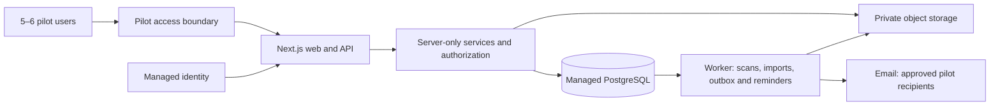

# SHIP: 10-week functional preview proposal

**Prepared:** 17 September 2026  
**Status:** Proposal for review; implementation and frontend development remain paused.  
**Capacity:** One full-time developer working with Codex, as requested.  
**Audience:** 5–6 invited pilot users.  
**Product authority:** [v5 wireframes](https://ship-wireframes-v5.netlify.app/). Build in `schmidthub`; IPLicensing is excluded.

## Recommendation

Build an invitation-only, persistently hosted pilot on the existing Next.js application. Use real, owner-approved IP records and documents. Users should complete actual submission, review, publication, discovery, communication, and administration journeys, with durable records and permissions. Production should grow from this application and its migrations rather than require a replacement backend.

Ten weeks is an **aggressive target for the full wireframe scope**, not yet a reliable fixed-price or fixed-scope commitment. Six users reduce operating load, not the complexity of six roles, legal decisions, large files, or batch imports. The schedule below includes all known workflow families, with bounded pilot implementations and a week-two feasibility gate. If it slips, agree a scope reduction or extend the schedule; do not describe a partial demo as a fully functional implementation.

“Fully functional preview” means every accepted pilot action persists, enforces permissions, handles failure, and works with approved data. Placeholder success messages, fixture-only metrics, an unrestricted role selector, and unavailable buttons do not satisfy that definition. Visual parity remains the goal; legal wording, missing fields, and ambiguous behavior require a recorded product decision.

## What the review found

Reviewed at code baseline `6e8942f`. This was a code and architecture review, plus a fresh walkthrough of representative wireframe flows; it was not an exhaustive audit of every modal or conditional field.

| Area | Current evidence | Implication |
| --- | --- | --- |
| Public UI | Home, portfolio, IP detail, participation pages, Learning Hub, topics, glossary and Resources exist | Reuse visual components; connect real services and finish unavailable actions |
| Data | `src/lib/content.ts`, `learning.ts`, and `resources.ts` contain local fixture arrays | Sample entries are not evidence of real IP ownership, real licenses, or available documents |
| Routing | Portfolio and article routes use fixture-derived `generateStaticParams` and `dynamicParams = false` | New database entries must resolve without a rebuild; add dynamic lookup, metadata, and cache invalidation |
| Identity | Sign-in is disabled; interest form does not submit | Build managed identity, approved account onboarding, sessions, profile and account settings |
| Application | `/dashboard` and `/one-time` are generic preview destinations; `/submit` is a participation/sign-in landing page | The authenticated wizard, all dashboards, review and administration UI still require implementation |
| Backend | No application API route handlers, database schema/migrations, server domain layer, object integration or worker found | Backend work starts at the foundation; public UI progress does not mean the application is nearly complete |
| Tests/operations | Last verified baseline: 36 component tests, lint, typecheck and Webpack production build passed; no repository CI workflow, database tests or browser E2E suite found | Preserve these checks and add backend, authorization, migration, browser and operational coverage |
| Documentation | `backend-architecture.md` is a detailed proposal; the sequence and test documentation contain historical milestones | Use the architecture as a base, and this document for the proposed pilot schedule and changed operating assumptions |

### Corrections and clarifications from the wireframes

1. **Preferred license is a submission field.** The wizard currently offers Open Research License, Apache 2.0, MIT, CC BY 4.0, Commercial License, Full IP Assignment, and Custom License Agreement. Preserve that preference in drafts and submitted snapshots. It is distinct from the immutable terms approved at publication; assignment must not be treated as an ordinary license acceptance.
2. **Technical approval requests legal review.** The legal decision then publishes. A client setting `status = published` must never substitute for those decisions.
3. **Batch imports create drafts.** The batch screen accepts CSV, XLSX, or a ZIP of attachments, at 500 MB maximum, and explicitly says nothing publishes automatically. Import validation does not submit or approve rows. Define ZIP-to-row association in week one.
4. **One-time invites have specific behavior.** The organization screen states 30-day expiry, invitation tracking and an in-flow recipient agreement. The guest entry screen promises publication only with the submitter's approval. Confirm how that approval and agreement are recorded; a third-party e-signature integration is not established by those screens.
5. **Visibility remains ambiguous.** The wizard says unchecking visibility restricts public indexing. Indexing and authorization are different. Proposed pilot rule: private means inaccessible to anonymous/unrelated users, not merely omitted from search; confirm before schema and policy completion.
6. **Roles overlap in the UI.** Reviewers and administrators can also submit. Implement composable grants within scopes, with explicit conflict-of-interest rules, rather than six mutually exclusive account types.
7. **Dashboard numbers are illustrations.** Implement counts and defined measures using real records/events. Do not seed invented licensing or download history to make the charts look populated.
8. **A real-data pilot changes operations.** Automated PR previews retain synthetic data and an email sink. The stable pilot needs approved real records, backups, controlled email to invited participants, and an accountable operator.

## Proposed pilot boundaries

| Included by the week-ten acceptance target | Deliberately bounded implementation |
| --- | --- |
| Existing public pages, search, facets, entry detail, Learning Hub and Resources | Serve approved data/content; supply actual approved downloads and linked detail content; repo-managed editorial updates are acceptable where no authoring UI is specified |
| Individual accounts, interest requests, access approval, profile/settings | Invitation/approval controlled; no shared password or arbitrary “view as” role selector; use managed account recovery and supported sign-in methods |
| All six role experiences | Shared dashboard/table/form components, with real scoped queries and commands; not six independently built applications |
| Single submissions across all five entry types | Save/resume drafts, conditional fields, contributor/contact information, preferred terms, concurrency protection and immutable submitted snapshots |
| Files and galleries | Preserve the 500 MB limit and formats; direct uploads, progress/retry, quarantine/scanning and authorized downloads |
| Technical and legal workflow | Return and information requests, resubmission, publication, edits, unpublish/takedown and audit; exact legal return semantics decided in week one |
| External-public route | Trusted source/domain policy with recorded verification; uncertainty routes to ordinary review; no unrestricted crawler |
| Licensing and communication | Exact approved terms before eligible downloads; commercial inquiry and assignment/custom paths route to the appropriate people, not automatic legal execution |
| Organization/program/platform management | Scoped membership and invitations, program management, settings, moderation, audit and defined dashboards |
| Inbox, notifications and email | Persisted threads and unread/read state; queued notifications and reminders to pilot recipients; periodic refresh is sufficient |
| Batch and one-time submission | One documented import schema, CSV/XLSX support and deterministic ZIP matching; expiring guest invitation and agreement with tracked completion |

Payment processing, marketplace checkout, automated contract negotiation, third-party e-signature, enterprise SSO provisioning, multi-region failover and a general-purpose CMS are not established pilot requirements. If required, they need explicit scope and estimate changes. Existing wireframe actions are not silently deferred because they are difficult. See [scope matrix](preview-scope-matrix.md).

Confirmed access requirement: restrict the entire pilot to invited test users at the hosting/access layer, including content, APIs and downloads. Within that boundary, test the public catalog projection without an application login. Internet publication of approved records can be a later explicit launch decision. `noindex` is useful but is not an access control.

## Architecture: keep the existing direction

Retain the proposed TypeScript modular monolith: Next.js web/API, server-only domain services, managed PostgreSQL, private S3-compatible storage, and a separately running worker from the same repository. A managed OIDC provider supplies identity; application membership policies decide access. Prisma remains the proposed data-access layer, subject to package confirmation before installation.

Use one region and a small managed deployment. Prefer an organizationally approved host that supports the web process and a durable worker; select identity, database and storage providers in week one using region, budget and existing accounts. No service purchase or dependency installation is authorized by this proposal.

Keep modules for identity/memberships, submissions, reviews/publication, assets, messaging, administration and jobs. Keep business transactions in services, not page components. Server-rendered pages can call services directly; expose HTTP endpoints where clients/integrations need them. Avoid a second backend framework, microservices, Redis or an external search engine until a measured need exists. This fits [Next.js backend guidance](https://nextjs.org/docs/app/guides/backend-for-frontend).

Centralize checks at the data/service boundary and enforce them for every command and read, following [Next.js authentication guidance](https://nextjs.org/docs/app/guides/authentication). Scope by owner, organization, program, assignment and thread participation. Navigation visibility is not permission enforcement.

Preserve these data contracts from the start:

- Mutable draft with optimistic version counter; immutable snapshot on submit; publication points to an approved snapshot.
- Draft/revision stores preferred license/assignment/custom choice and notes. A SHIP grant references approved immutable terms and content revision; externally hosted access records its source/terms without inventing a SHIP grant.
- Atomic review transitions, audit and outbox writes; idempotent submit, decision, acceptance and import commands.
- Asset metadata includes checksum, size, actual type, storage key, scan status, visibility and rights/provenance. Direct multipart uploads keep large files out of web request bodies; see [S3 multipart documentation](https://docs.aws.amazon.com/AmazonS3/latest/userguide/mpuoverview.html).
- Publication invalidates catalog caches; authorization happens again before file access. Short-lived signed URLs have a residual access window after revocation, so agree that window and use a proxy if immediate revocation is required.
- Durable worker jobs have leases, bounded retries, deduplication and failure visibility. PostgreSQL supports queue-style row claiming with `SKIP LOCKED`; keep this restricted to job claims, not ordinary consistent reads. [PostgreSQL reference](https://www.postgresql.org/docs/current/sql-select.html)

## Real seed data and pilot users

The project team is assembling a list of real-world IPs, and the project owners will approve its use. The user confirmed that the preview must be accessible only to test users and reported no current confidentiality issues. The records/files themselves have not yet been supplied. Data availability is a delivery dependency, not a reason to relabel existing fictional entries as real.

**Proposed seed target:** 20–30 genuine IP records across the five entry types, with 10–15 approved downloadable files and representative images. Aim for two organizations and at least two programs if genuine approved data supports that scope. These are planning targets to confirm in week one; use separate synthetic test organizations for isolation tests if only one real organization participates.

**Six-user arrangement:** one submitter, one technical reviewer, one legal reviewer, one organization admin, one program admin and one platform admin. The latter three can also exercise permitted submission flows. With five people, combine organization and program administration through explicit scoped grants. Do not combine author and approver for the same item, share accounts, or treat role testing as authority to execute real agreements. Automated isolated tests cover additional cross-scope users.

**Data owner responsibilities:** provide an initial five-record pack by the end of week one and the agreed full pack by week three. A designated IP/legal owner approves titles, claims, organizations, contributor names, contact exposure, terms and each file's permitted use. Confirm whether confidential or unpublished work is permitted on the selected host before importing it.

Use the [seed manifest template](seed-data-manifest-template.csv); repeat the stable record key for multiple assets. Every seed record needs a manifest containing source URL or source-system ID, stable import key, source owner, import timestamp, approval evidence, target org/program, visibility, real/synthetic classification, preferred/approved terms, contact consent, and attachment checksums/rights. Use minimal personal information. Seed tooling must validate, dry-run, deduplicate and record imports; re-running it must not overwrite user edits or fabricate historical review decisions.

Separate three datasets:

1. **Pilot records:** real approved material with genuine provenance and actions. Imported published material records a specific authorized import/publication event, not a fabricated multi-review history.
2. **Pilot exercises:** where participants practice workflow on real material, label the exercise and keep it private unless a real publication approval is given. Reset only these records through a controlled process.
3. **Automated fixtures:** synthetic users, malicious-file cases, boundary-size files and cross-organization scenarios in disposable test environments. Exclude them from pilot analytics and real email.

Published learning articles, legal templates, privacy/contact policies and the 19 resource entries also need actual approved content or working authorized external destinations. A filename/size displayed in the current UI is not a deliverable file. Missing content cannot be hidden behind a successful button at acceptance.

## Ten-week delivery schedule

Weeks are relative to an agreed start date. Assume 40 developer hours/week: **400 total, with 320 scheduled and 80 reserved for integration, defects, decisions and interruptions.** Codex is assistance within this capacity, not an additional developer. Hour allocations are planning allowances, not validated estimates; weeks 3, 7 and 8 carry the greatest scope risk.

| Week | Planned hours | Working deliverable | Evidence required to pass |
| --- | ---: | --- | --- |
| 1 — Scope, data and deployment decisions | 30 | Complete screen/field/action inventory; role/state matrix; seed manifest and five approved records; provider/region selection; schema draft and acceptance scenarios | Product owner resolves preferred terms, private visibility, external-public eligibility, guest agreement and batch association rules; every visible action has an owner and planned behavior |
| 2 — Identity and persistent foundation | 32 | Managed sign-in/invites, memberships, sessions, initial schema/migrations, server policies, pilot environment, CI and basic worker/outbox | Two scoped accounts pass positive and negative access tests; revocation works; migrations and a small restore succeed; re-estimate remaining scope against actual progress |
| 3 — Drafts and files | 36 | Authenticated wizard for five types, save/resume, contributors, preferred terms, file/gallery uploads, scan/quarantine and signed access | Reload/resume and stale-edit conflict tested; 500 MB allowed upload plus oversized/type-mismatch/scan-failure cases exercised; unscanned/private objects denied |
| 4 — Technical review and correspondence | 36 | Submitter dashboard, My Submissions, technical queue/assignment, return/revise, information requests, submission-linked inbox and queued email | Different users complete submit → request information → respond/return → resubmit; no self-review, duplicate transition or cross-scope read |
| 5 — Legal review and publication | 34 | Legal queue, approved terms binding, publish/unpublish, new private draft for published edits, trusted external-public route | Technical approval alone cannot publish; legal approval publishes the exact snapshot; eligibility failure queues review; public cache respects takedown |
| 6 — Public journeys and content | 34 | Database-backed portfolio/details/facets; protected assets and acceptance; contact-holder flow; real Learning Hub/resource content; interest requests, profile/settings and notifications | New entry resolves without build; accepted terms/revision recorded; real eligible file downloads; unauthorized access denied; every public navigation destination has approved content |
| 7 — Administration and reporting | 36 | Org/program/super-admin screens, team and program management, role changes, settings, moderation, audit, record-derived counts/benchmarks | Role escalation and last-admin tests pass; program isolation and audit completeness verified; each metric has a definition and reconciles to records |
| 8 — Batch and guest paths | 36 | CSV/XLSX imports, agreed ZIP association, row validation and resumable status; 30-day one-time invites, in-flow agreement/approval, guest draft and ownership handoff | Import replay creates no duplicates and no automatic publications; expired/reused/revoked tokens fail; successful guest submission is recorded once under the correct organization |
| 9 — Pilot rehearsal and hardening | 28 | All 5–6 users exercise their role journeys on approved data; browser E2E, accessibility/mobile checks, failure recovery, monitoring and content audit | Critical journeys pass with no placeholder success; denied-access tests pass; backup restore, worker restart and interrupted upload are rehearsed; defects triaged |
| 10 — Corrections and handover | 18 | Resolve acceptance defects, freeze seed baseline, finalize runbooks and production backlog, release approved pilot version | Owner signs acceptance checklist; all required actions functional; clean deployment/rollback rehearsal; support owner and documented go/no-go decision |
| **Total** | **320** | **80 hours remain unscheduled contingency** | **Unused contingency is not permission to add scope** |

Show a working increment weekly. Start user feedback in week three, rather than waiting for week nine. Use the same components and services across roles to keep the breadth tractable.

### Feasibility and change control

At the end of week two, estimate each remaining action from the completed inventory. Proceed with the full ten-week target only if the remaining forecast fits remaining capacity **including test/launch time and contingency**. If it does not, choose explicitly between extending delivery or accepting a reduced first pilot.

If the date must be fixed, the first proposed reductions are batch import breadth, advanced benchmark drilldowns, and less-used settings/customization. These are **fallback recommendations, not approved omissions**. Identity, scope enforcement, durable state, legal publication rules, file safety, backup/restore and real-data approval are not fallback cuts. A reduced pilot must have a newly agreed scope matrix and cannot claim full wireframe parity.

## Pilot operating model and acceptance

The developer owns implementation and technical operations. The product/data owner supplies decisions and content in 1–2 working days, with roughly 2–4 hours/week reserved for review. An IP/legal owner is available in weeks one, five and nine to settle terms and approval semantics. Each participant reserves time for weekly feedback and the final role-based rehearsal. These contributions are additional to the developer's 400-hour capacity.

Separate local/test/PR environments from the stable pilot and future production. Only the stable pilot receives approved real data and can email an allowlist of participants; tests and PR previews use synthetic data and a mail sink. Store secrets outside Git. Require managed recovery and strong authentication for privileged accounts; document membership revocation and offboarding.

Proposed pilot recovery targets: recover to the previous 24 hours of data and restore service within four business hours. Validate these against the chosen database and object storage backup/retention setup. The restore test must recover both metadata and a downloadable object. Provide a one-command or documented release procedure, migration ownership, failure/queue views, and an operator runbook.

The target is six simultaneous active sessions, including concurrent edits/reviews and overlapping large uploads. Provisional performance targets: ordinary catalog and command requests complete in under two seconds at the 95th percentile on the selected pilot setup; upload duration is measured separately and remains bandwidth-dependent. Record the test data size, load and environment instead of treating these as a production SLA.

Launch acceptance requires:

- All rows in the accepted scope matrix pass, including negative authorization cases and reload/retry behavior.
- Real seed provenance/content approval complete; synthetic data and exercise events excluded from live benchmarks.
- No unresolved issue that exposes private data, loses records, grants incorrect rights or bypasses review.
- Working login/recovery, submission, legal publication, eligible downloads, messaging, administration, batch and guest flows unless an explicit revised scope excludes a flow.
- Real-data operation backed by a tested restore, rollback procedure, monitoring and an identified support owner.
- No shared identities, unrestricted role switcher, fixture-only metrics or unavailable actions on accepted journeys.

Infrastructure cost is not quoted yet. Week-one provisioning must include a written monthly estimate for web, worker, database/backup, object storage/egress, identity, email and monitoring, with a spending cap approved by the owner. Storage volume and egress matter more than the six-user count. No purchases or deployments happen as part of this planning task.

## Transition from pilot to production

Carry forward the repository, domain services, migrations, stable identifiers, provenance and automated tests. Before broader release, perform a separate readiness review covering independent security testing, organization onboarding/SSO needs, load and abuse testing, retention/deletion rules, accessibility, approved public/legal content, incident response and a production support agreement.

Provision separate production credentials, database and storage. Migrate only approved pilot records through a rehearsed export/import or database-and-object migration; preserve IDs, checksums, real approvals and legally relevant history. Exclude exercises and test accounts. Obtain user/data-owner approval for promotion, reconcile counts and access, and rehearse rollback. Do not copy all pilot data blindly or reset real activity with a seed script.

A worker, dedicated search service or separate API can be expanded later without changing the core workflow contracts. Production readiness is a distinct acceptance decision; ten weeks delivers the agreed small-cohort pilot, not a claim of enterprise scale or compliance certification.

## Decisions still open

- Named delivery contact for the owner-approved real IP list, record/file delivery dates, usage rights and any future confidentiality restrictions. Test-user-only access is already confirmed.
- Hosting region/provider, budget cap, identity provider and desired sign-in methods.
- Which 5–6 people hold the scoped roles; who can make real legal/publication decisions.
- Private-access semantics, review scope/self-review rule and trusted external-source eligibility.
- Approved license/assignment/custom terms, guest agreement and submitter publication approval.
- Batch ZIP association, operational row limit, metric definitions and editable settings.

Resolve these in week one and record them as decisions. The main outcome of this review is a concrete scope and delivery proposal; no frontend code or backend infrastructure is changed by it.
