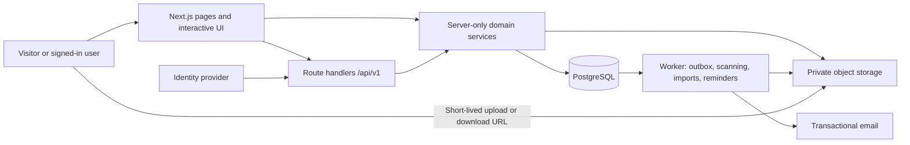
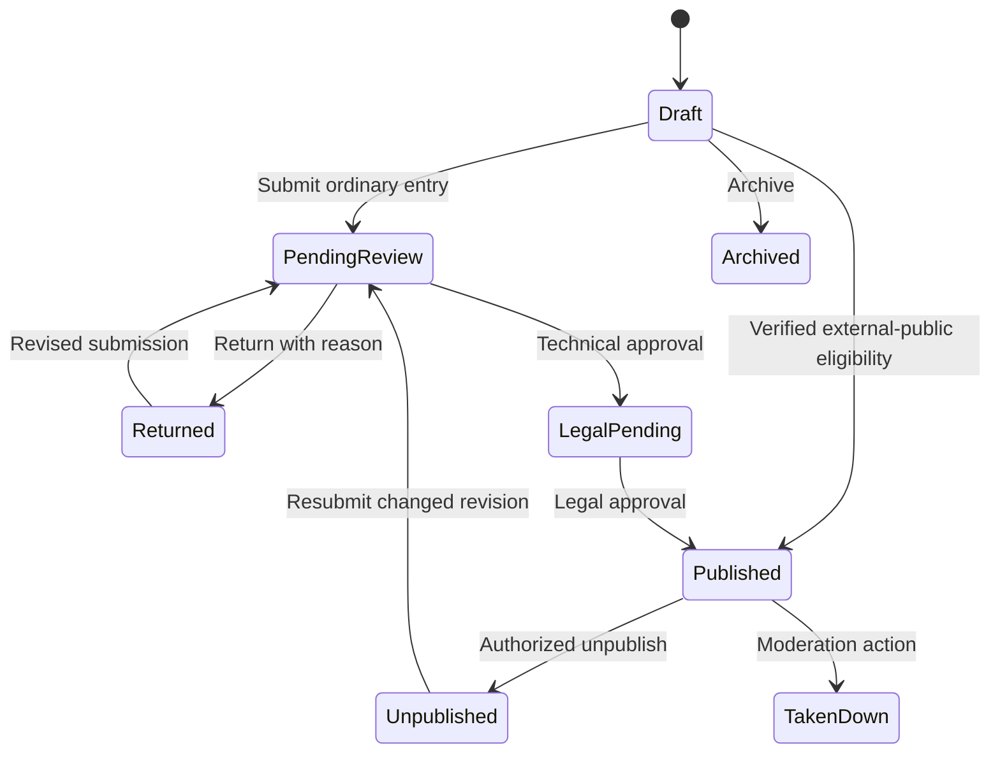

# SHIP backend architecture proposal

Date: 2026-09-16. Status: proposed, not implemented.

## Authority and starting point

The [v5 wireframes](https://ship-wireframes-v5.netlify.app/) define the product.
Build the full app in `schmidthub`. Do not import code, schemas, migrations, or
architectural assumptions from IPLicensing. The historical twelve-week plan is
superseded; its Python backend, shared-password identity selector, 50 MB limit,
and feature exclusions are not requirements.

Observed directly: home and public navigation, all six dashboard roles, two-step
submission wizard, reviewer and legal decision screens, program and organization
overviews. Navigation exposes further administration surfaces. Where the UI does
not specify semantics, this document labels a proposed rule or open decision.
The wireframes are not a complete authorization or persistence specification.

## Recommended shape

Start with a TypeScript modular monolith in the existing Next.js application,
PostgreSQL for transactional records, private S3-compatible object storage, and a
separate worker process from the same repository for durable background jobs.
This choice follows the current Next.js app and tightly related review workflow;
it has no dependency on any previous POC. Keep business logic in server modules,
so a dedicated API service can be extracted if independent clients or deployment
needs justify it later.

Next.js Route Handlers provide the HTTP boundary; Server Components can call
server services directly instead of making HTTP requests to their own server.
Long-running imports, scans and mail belong in the worker, not in a request's
lifetime. See [Next.js backend guidance](https://nextjs.org/docs/app/guides/backend-for-frontend).



### Proposed stack decisions

| Layer | Proposal | Reason / decision still needed |
| --- | --- | --- |
| Web and API | Existing Next.js App Router, Node runtime | One language and repository; no second web framework initially |
| Database | Managed PostgreSQL | Relational organization scopes and atomic workflow decisions |
| Data access | Prisma plus reviewed SQL migrations | Typed queries and migration history; select/version-check before installation |
| Authentication | Managed OIDC identity, server session | Avoid implementing passwords; choose vendor after SSO, budget, residency requirements |
| Authorization | Application policy services backed by memberships | Roles alone cannot express ownership, program scope, or review assignment |
| Storage | Private S3-compatible bucket | 500 MB direct/multipart uploads; choose vendor/region before integration |
| Jobs | Durable Postgres outbox and worker initially | Retry without introducing Redis immediately; measure workload before choosing a queue product |
| Search | Postgres text search and structured facets | Title, description, type, subject, organization, program, tags; dedicated search only if measured need |
| Deployment | Web process, worker, managed DB, object store | Hosting vendors are undecided; provision separate preview/staging/production data |

These are planning recommendations, not approved package additions or service
purchases. No backend dependencies, accounts, or infrastructure are created by
this POC task.

### Proposed code boundaries

```text
src/app/                    public pages, authenticated routes, /api/v1 adapters
src/server/auth/            verified identity, sessions, policies
src/server/organizations/   organizations, programs, memberships, invitations
src/server/submissions/     drafts, revisions, author details, submit routing
src/server/reviews/         queues, assignments, decisions, information requests
src/server/catalog/         public projections, facets, featured entries
src/server/licensing/       license versions, acceptance, download grants
src/server/assets/          upload sessions, validation, visibility, signed URLs
src/server/messaging/       threads, participants, notifications
src/server/admin/           moderation, settings, reporting, audit queries
src/server/jobs/            transactional outbox, scheduled job definitions
src/worker/                 background execution and retry handling
prisma/                     future schema and reviewed migrations
```

Mark server modules server-only. HTTP adapters validate input and session, then
call services that authorize the specific resource and own transaction boundaries.
Never place authorization only in navigation or layouts. Return explicit public
and private DTOs; never serialize raw database models. Follow the
[Next.js authentication guidance](https://nextjs.org/docs/app/guides/authentication)
for a centralized data-access boundary and checks at every entry point.

## Product domains and proposed data model

Use UUID internal IDs and an independent stable public entry identifier. All
records have timestamps; editable aggregates have an integer revision for
optimistic concurrency. Organization-owned relations must agree on organization
ID, enforced through constraints where possible and transactional validation.

| Records | Key fields and relationships |
| --- | --- |
| User / Session | Unique identity-provider subject; profile; active/disabled; session expiry and revocation |
| Organization / Program | Program belongs to one organization; names, settings, status; membership scopes |
| Membership / RoleGrant | User, organization, optional program, role, active/pending; uniqueness within scope; platform grants separate |
| Invitation | Hashed token, intended email, scope/role, purpose, expiry, used/revoked timestamps |
| Submission | Owner, organization, optional program, active draft, latest submitted revision, workflow state, visibility |
| SubmissionDraft | Mutable working copy with version counter for conflict detection; partial wizard fields and upload references; copied from a returned or published revision when editing resumes |
| SubmissionRevision | Immutable snapshot created on submit: title, entry type, dates, subject, abstract, description, external sources, licensing goals/notes |
| Contributor | Revision, ordered inventor/author name, affiliation; distinguish person attribution from application account |
| Contact | Revision contact email and consent/visibility policy; keep out of public DTO by default |
| Tag / SubmissionTag | Normalized tag and revision relationship; supports catalog facets |
| License / LicenseVersion | License family, immutable terms/version/hash, availability, custom terms reference |
| Asset / RevisionAsset | Object key, original name, detected MIME, byte size, checksum, scan state, document/image/video kind, visibility |
| UploadSession | Actor, draft, reserved object key, expected size/type, multipart state, expiry |
| Review / ReviewDecision | Revision, assigned scope/reviewer, technical/legal stage, decision, reason, timestamps |
| InformationRequest | Review, question, response thread, resolved timestamp; does not implicitly approve |
| Publication | Entry ID, approved revision, access mode, selected immutable license version when SHIP grants rights, external terms/source snapshot when access stays off-platform, first publication time, current availability |
| LicenseAcceptance / DownloadGrant | Exact revision/asset/license version, actor or guest identity, acceptance timestamp, grant expiry |
| Thread / Participant / Message | Submission-linked conversation, authorized participants, message body, moderation state |
| Notification / Preference | Recipient, event, channel, read time, delivery preference |
| ModerationCase / Action | Target, reason, reporter, moderator, action, appeal/reinstatement history |
| AuditEvent / OutboxEvent | Actor, scope, action, target/revision, timestamp, request ID; durable delivery status separately |
| BatchImport / ImportRow | Uploader, mapping/version, per-row validation/result, idempotency key |
| SettingsVersion / ActivityEvent | Scoped settings history; defined analytics events, excluding raw private documents |

The wizard exposes five entry types, five subject categories, multiple licensing
goals, inventor names, affiliation, contact email and public visibility. Preserve
these distinctions. External-source inputs vary by entry type; inventory those
conditional fields before finalizing the submission schema. Do not infer a
license from the sample entry's subject or type.

Recommended draft boundary: autosave changes only `SubmissionDraft` and increments
its version. Submission validates the draft, copies it into a new immutable
`SubmissionRevision`, and records the submitted revision ID for review. A return
for changes or a published edit starts a new draft from that snapshot; it never
rewrites a revision under review or already published.

The wizard records licensing goals, not a final legal grant. A license version
therefore need not be required on every draft or submission. Before a
SHIP-managed download or grant is published, the authorized legal/publication
step binds the approved revision to an immutable `LicenseVersion` (or explicitly
models multiple versioned offerings if the product requires them). Acceptance
and download grants reference that exact publication, revision and version.
An external-public entry with no SHIP licensing transaction instead records its
external source and terms snapshot; it does not issue a SHIP license grant. The
POC needs only the wireframe's sample license labels, with no backend records.

Important indexes: submissions by organization/program/state and updated time;
reviews by stage/state/assignee; public entries by publication time and facets;
messages by thread/time; notifications by user/read state; audit events by
scope/time/actor; outbox jobs by availability/status. Use bounded pagination,
stable ID tie-breaks, foreign keys, and unique constraints for tokens and replay keys.

## Roles and authorization

The six roles are Submitter, Reviewer, Legal Reviewer, Org Admin, Program Admin,
and Super Admin. Anonymous visitors use the published catalog. The wireframe role
selector demonstrates views; it must not become production authentication.

Proposed default policy, subject to confirmation of cross-organization review:

| Role | Allowed scope | Important limit |
| --- | --- | --- |
| Submitter | Own drafts, revisions, submissions, threads | Cannot publish by setting status or grant own membership |
| Reviewer | Assigned technical review scope | Cannot review own work or make legal approval |
| Legal Reviewer | Assigned legal queue | Cannot bypass missing technical review |
| Org Admin | Organization, programs, team and moderation | Cannot grant platform authority or cross-organization access |
| Program Admin | Assigned program team, entries and settings | Cannot access sibling programs or promote to Org Admin |
| Super Admin | Platform management, audit, moderation | Sensitive actions explicit and audited; no silent impersonation |
| Visitor | Published and publicly visible projection | No private drafts, notes, contact details, or unapproved assets |

Check active membership on each operation. Route IDs and client role claims are
untrusted. Role changes take effect immediately; enforce last-admin protection.
Thread access is participant-based. A private entry remains private even if
approved; publication state and discoverability are separate fields. Decide
whether private approval permits organization access or named recipients before
implementing grants. Proposed self-review prohibition is a product decision,
not a fact specified by the screens.

## Submission and publication workflow

Observed technical decision UI says **Approve → Request Legal Review**; legal
approval says **Publish this entry**. Do not implement the historical plan's
technical-approve-directly-publishes shortcut.



Information requests keep the review stage, create a thread and notify the
submitter. Whether an answer needs a new revision is determined by whether the
content changes. Legal UI shows approve/request-info; a separate legal rejection
state is **unconfirmed** and must not be invented as an observed requirement.
Reinstatement and archive permissions need an explicit transition table before
implementation.

Automatic publication is limited by the wireframe rule: already fully public on
a recognized external domain **and** no licensing transaction on SHIP. Proposed
implementation: normalized HTTPS URLs, managed domain allowlist, verified public
source and no restricted attached content, with an auditable routing reason.
Client-supplied booleans are insufficient. A failed or uncertain verification
routes to review. Any remote fetch must reject private network targets and
revalidate redirect destinations. Exact eligibility and recognized domains remain
open product decisions.

Recommended authority rule: public visibility alone does not prove permission
to publish an item through SHIP. Require the submitter's active organization
membership, an explicit rights-to-submit attestation, and a previously verified
organization-to-source-domain or trusted-feed relationship before automatic
publication. A URL on an allowlisted domain without that relationship takes the
ordinary review path. Record the evidence and policy version with the routing
decision, and let an organization admin revoke the trusted relationship.

For each transition, atomically verify actor scope, expected state and revision;
write the new state, decision, publication snapshot, audit event and outbox event.
Conflicts return 409, replayed commands return the original result. Notifications
retry independently. Editing published work creates a private new revision; it
never mutates the public snapshot until approved.

## Proposed API contract

Prefix `/api/v1`. These names are proposed; no routes below exist yet.

| Surface | Endpoints / operations |
| --- | --- |
| Identity | Session, sign-in callback/logout, `GET/PATCH /me`, preferences |
| Catalog | `GET /entries`, `/entries/:publicId`, `/facets`, `/organizations/:slug`, `/licenses` |
| Drafts | `POST /submissions`, `GET/PATCH /submissions/:id`, revision history, `POST /submissions/:id/submit` |
| Review | `GET /reviews?stage=technical|legal`, detail, `POST /reviews/:id/decisions`, information requests |
| Assets | Create upload session, sign parts, complete/abort upload, authorized asset access |
| Licensing | `POST /entries/:id/acceptances`, `POST /assets/:id/download-grants` |
| Communication | Threads, messages, notification read state and preferences |
| Organizations | Organization/program details, members, role grants, invitations, settings |
| Administration | Moderation cases/actions, user status, audit events, scoped reports, settings |
| Imports and guest submissions | Batch create/validate/commit/status; redeem one-time invitation and submit |

Every write validates a schema, authorizes the target, and rejects unknown fields.
Use session cookies marked HttpOnly/Secure with CSRF/origin protection for writes.
Bound text lengths and pagination. Structured errors include code, safe message,
field errors and request ID; distinguish 401, 403/404, 409, 422, and 429.
Require idempotency keys on submissions, decisions, import commits and acceptance
commands. Public responses omit private fields by construction. Document schemas
and generate client contracts; shared TypeScript types alone do not validate inputs.

## Files, licensing and jobs

The wireframe limit is **500 MB** and includes PDF, DOCX, CSV, ZIP, JPG, PNG, MP4.
Preserve it in the plan. Direct multipart upload bypasses application request-body
limits. Verify size/type/checksum after upload, quarantine until scanning and
validation complete, and expire abandoned uploads. ZIP inspection needs expansion
limits. Worker failures leave files unavailable with a retryable user status.
No public bucket access; signed URLs are short lived and issued after resource
policy checks. Decide retention and deletion obligations before production.

License acceptance records reference immutable terms and entry revision. A
request cannot turn a commercial inquiry into an executed license. The wireframes
do not establish payment, contract negotiation or e-signature requirements; those
are undecided integrations. Guest acceptance/contact forms need rate limiting and
an explicit minimum-data policy. Count grant issuance separately from confirmed
transfer; a signed URL alone does not prove a download completed.

Use the outbox for notification fan-out, email, scanning, external verification,
imports and reminders. Claim jobs with leases, bound retries with backoff, maintain
dead-letter inspection, and use event IDs for idempotent handling. Batch imports
validate first and show per-row errors before commit. One-time tokens are hashed,
scoped, expiring and atomically consumed; retrying a completed submission must not
create a second entry.

## Operations and reporting

Keep development, preview and production databases and buckets separate. Seed
only synthetic/wireframe fixtures with explicit demo labeling. Migrations run as
a release step with backup/restore rehearsal; use expand/backfill/contract changes
and compatible application rollback. Configure connection pooling and explicit
request/job timeouts. Preview builds must not send real email.

Log request IDs and state transitions, not tokens, email bodies, uploaded content
or private notes. Monitor API failures, denied access, queue age, scanning failures,
email delivery, and download errors. Establish backup recovery objectives, storage
lifecycle and access review before launch. Public catalog caching must be
invalidated on publish/unpublish/takedown; authenticated responses are private.

Wireframe benchmarks need definitions before implementation: licensing-rate
numerator/denominator, eligible published cohort, downloads per entry, return
rate, timezone and reporting interval. Numbers on dashboards are illustrative,
not analytics requirements or targets. Derive production reports from recorded
events and distinguish demo fixtures from live events.

## Decisions to settle before backend implementation

1. Identity provider, invitation-only vs public registration, SSO and hosting region.
2. Review assignments across organizations, multi-role membership and self-review policy.
3. External-public eligibility, domain allowlist, and treatment of private visibility.
4. Legal review return/rejection, reinstatement and edits after publication.
5. License acceptance text/guest identity, contact visibility and retention.
6. Batch template and field mapping; one-time submission account/ownership rules.
7. Reporting definitions and settings editable at each administrative scope.
8. Deployment/storage vendors, capacity/cost envelope and recovery objectives.

These questions do not block the home POC. Resolve them with wireframe walkthroughs
at their implementation milestone, and record explicit decisions instead of
silently inheriting assumptions from the old delivery plan.
