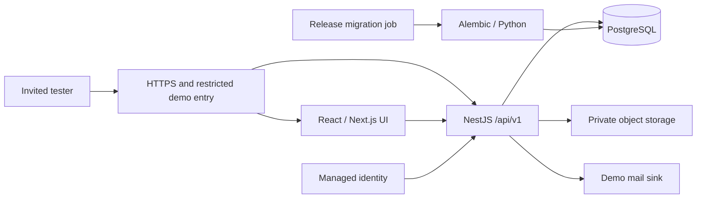
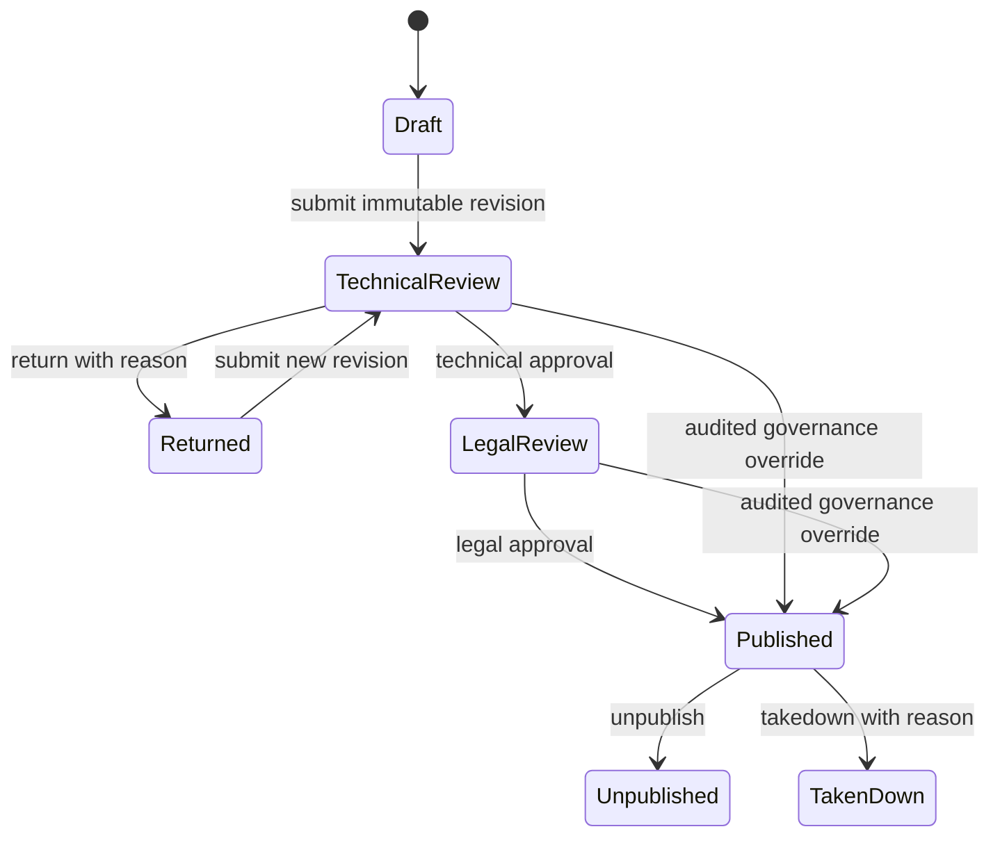

# SHIP demo architecture and phase-2 path

17 September 2026 · Proposed design for the [10-week demo plan](10-week-demo-plan.md). This replaces the earlier Next.js-only backend recommendation **for this proposal**.

## Recommendation

Use the existing TypeScript React/Next.js frontend, a NestJS modular monolith, managed PostgreSQL, private object storage, and **Alembic as the only schema migration owner**. Keep one repository, one business API and one relational database. Python is a build/deployment tool for migrations, not another application server.

The requirement is six invited people exploring seeded workflows, with a phase-2 production path. That calls for real persistence, permissions and transactions with deliberately small operational scope. It does not call for microservices, Kubernetes, Redis, a search cluster, event sourcing, a CMS, or an enterprise identity rollout.



Route `/api/v1` to Nest at the reverse proxy on the same origin. Next may render initial pages using that API, but has no database credentials and no domain services. Protected fetches must not use a shared public cache. Nest remains authoritative even if requests skip the UI.

## Alternatives considered

| Choice | Benefit | Cost / decision |
| --- | --- | --- |
| Existing Next UI + Nest API + Alembic | Reuses tested presentation; matches requested stack; one business boundary | Two Node processes and Python migration tooling. **Recommended.** |
| Fresh React/Vite UI + Nest API + Alembic | Simpler client-only rendering model | Port routes, metadata and tests; little benefit to the core demo. Use only if week-1 deployment evidence makes Next reuse materially more expensive. |
| Next UI/API + TypeScript migration tool | Fewest runtime boundaries | Conflicts with explicit NestJS/Alembic requirement. Not the baseline. |

## Repository layout and design rules

Keep the existing frontend at the repository root initially; avoid an unnecessary move of all source files.

```text
src/app/                         existing React/Next routes
src/features/                    submission, review, admin client components as needed
src/components/ui/               shared presentation primitives
api/src/auth/                    identity adapter, sessions, resource policies
api/src/organizations/           organizations, programs, memberships and settings
api/src/submissions/             draft/revision lifecycle and review commands
api/src/catalog/                 published projection, filtering and aggregates
api/src/assets/                  upload and authorized file access
api/src/messaging/               threads, notifications, captured demo mail
api/src/admin/                   scoped moderation and audit queries
api/src/database/                connection pool and transaction helper
packages/api-client/             generated OpenAPI client/types
database/alembic/versions/       sole schema history
database/seed/                   deterministic synthetic fixture inputs
docs/adr/                        short policy/design decisions
```

Use a pnpm workspace without adding a build orchestrator. Wire the root checks to all packages once the API exists. Follow `~/Development/Agents`: feature modules; explicit constructor injection; no circular imports; thin controllers; validated DTOs; resource checks in services; repositories with parameterized SQL. Avoid speculative base classes and generic workflow builders. React state is for UI editing; server data comes from the API. Reuse a form/table only after actual duplication appears. Generate API types, not a second hand-maintained frontend domain model.

## Alembic and TypeScript interoperability

Alembic runs Python migration scripts using SQLAlchemy; it is not a NestJS ORM. Keep its environment isolated and pinned. [Alembic tutorial](https://alembic.sqlalchemy.org/en/latest/tutorial.html).

For this small application, use `pg` behind typed Nest repositories with explicit column lists and parameterized SQL. Keep SQL local to each feature's repository. This trades automatic ORM inference for simple ownership and avoids maintaining Python models plus a separate ORM schema. Nest supports multiple database integration approaches. [Nest database guidance](https://docs.nestjs.com/techniques/database).

- Author explicit Alembic revisions (`op.create_table`, indexes, constraints, reviewed SQL as appropriate). **Do not expect autogenerate to infer a schema from TypeScript.** A database and SQLAlchemy metadata must be supplied for that comparison. [Alembic autogeneration](https://alembic.sqlalchemy.org/en/latest/autogenerate.html).
- No Prisma/TypeORM/Drizzle migrations, ORM schema synchronization or API-startup DDL. Alembic history is authoritative.
- Run one serialized migration job per environment before deploying compatible API code. Runtime DB credentials cannot perform schema changes.
- CI creates a disposable Postgres database, applies all migrations, seeds it and executes repository/contract tests. Also upgrade a database at the preceding release revision. Detect multiple Alembic heads before merge.
- Handwritten TypeScript row types can drift. Integration tests must exercise the actual queries and map responses to explicit DTOs; avoid `SELECT *` and unchecked JSON casts.
- Use expand/contract schema changes. Roll back the application to a schema-compatible release; destructive downgrade is not the default recovery procedure.
- Multi-statement commands share one checked-out client from `BEGIN` through `COMMIT`/`ROLLBACK`, never independent `pool.query` calls. [node-postgres transactions](https://node-postgres.com/features/transactions).

Package choices are proposals. No new production dependency is installed by this planning task. Confirm the implementation dependency list once, per repository working agreements.

## Domain model

Start with these aggregates; create tables with the feature that needs them rather than building a universal platform in week 1.

| Aggregate | Durable records and invariants |
| --- | --- |
| Identity and scope | Users keyed by provider subject; sessions; organizations; programs; memberships with role and optional program scope. Program belongs to exactly one org. Platform grants are separate. Disable/revoke is checked on every request. |
| Submission | Owner, org/program, workflow stage, visibility and row version. Mutable draft JSON has a schema version; indexed identity/scope/status fields are relational columns. Partial draft is valid; submitted snapshot is fully validated. |
| Revision and review | Immutable submission revision with all field values, contributors, preferred terms and assets; review decision references exact revision/stage/actor. Old decisions cannot approve a new revision. |
| Publication | Stable entry ID, published revision, approved terms version, published timestamp and availability. Updating a working draft does not change the public projection. |
| Assets | Owner/draft, opaque object key, filename, measured type/size, status, checksum and revision associations. Client-supplied bucket keys never establish ownership. |
| License demonstration | Versioned sample terms, acceptance bound to user + revision + terms hash, and download event. This records demo behavior, not a claim of an executed commercial license. |
| Correspondence | Threads, explicit participants, messages, per-user read state, notifications. Public inquiries become scoped threads; reviewers cannot read all inquiries merely because they review an entry. |
| Administration | Typed allowed settings and append-only audit events. Record actor, scope, command, target/revision, timestamp and request ID; avoid copying message bodies or secrets into logs. |
| Small imports/intake | Import ID, content hash, result IDs for deduplication; interest/contact requests. Guest-token tables are phase 2. |

Use UUID keys, unique constraints, foreign keys and checks on state values. Enforce matching org/program relationships with composite keys where practical and service validation. Index membership scope, owner/status, review stage, publication time, thread participants and notification recipient. Store tags as normalized controlled values or a bounded array initially; do not put all relational relationships into one JSON blob.

## Proposed policy defaults

These resolve wireframe ambiguities for scheduling; they are design recommendations, not claims of observed backend behavior. Record sponsor changes by the end of week 1.

| Question | Demo default |
| --- | --- |
| Role selector | Individual invited accounts; navigation only offers grants already held by that account. The wireframe's unrestricted persona switch is not authorization. Tester assignments cover all six roles; automated fixtures provide extra hostile/sibling accounts. |
| Technical versus legal approval | Technical approval moves to legal review. Only legal approval ordinarily publishes. Technical “Approved” means stage completed, not published. |
| Program “Approve & publish” | Explicit, separately authorized governance override in the actor's program; requires reason and recorded sample terms; cannot bypass scope or asset readiness. Platform moderator can override platform-wide. Org administration alone does not silently confer legal approval. |
| Submitter edits to published content | Create a new working revision and resubmit. Existing publication remains available until replacement approval. Label the UI clearly. |
| Immediate admin edits | Create an immutable replacement snapshot and switch publication atomically with reason/audit. Preserve prior snapshot; do not mutate historical approvals. |
| Self-review | Disallow ordinary self-approval. Separate reviewer/legal identities handle demonstration; only explicit governance override can depart, with audit. |
| “Public indexing” | Within the restricted demo, checked means eligible for the demo catalog. Unchecked is owner + authorized reviewers/admins only, including direct URLs and assets. Production unlisted-versus-private semantics need separate approval. |
| External-public fast path | Phase 2. Retain URL fields and source links; new demo submissions follow ordinary review. Clearly revise routing copy instead of pretending the immediate path works. |
| License and assignment choices | Preserve all seven preferences. Open samples can exercise acceptance/download; commercial/custom/assignment examples use an inquiry, without payments, e-signature or transfer-of-ownership logic. |



Info requests are pending tasks attached to a review stage, not implicit approval or a new publication state. A response leaves the entry at that stage; content changes create a new revision and invalidate obsolete pending decisions. An edit to published content creates a parallel draft while the old publication remains live. Archive is a separate non-public flag for owned drafts/returned records; it cannot hide an active review or publication through an unchecked update.

## Authorization and HTTP contracts

Global authentication guard plus per-resource policy checks: actor, role, org/program, ownership, review scope and current state. A role name alone is insufficient. This follows Nest's distinction between basic role checks and operation-level permissions. [Nest authorization](https://docs.nestjs.com/security/authorization).

| API family | Core contract |
| --- | --- |
| `GET /me`, `PATCH /me`, session routes | Validated identity, current grants, profile. Display-name edits never grant a role; provider email/password management stays with the provider. |
| `POST /submissions`, `PATCH /submissions/:id/draft` | Partial draft + version. Return `409` with reload guidance for a stale version. Never silently overwrite. |
| `POST /submissions/:id/submit` | Validate complete draft; create immutable revision and review task in one transaction. Use an idempotency key. |
| `POST /reviews/:id/decisions` | Expected revision/stage + decision + required reason; recheck scope and state under transaction/row lock. Duplicate request returns the existing result. |
| `GET /catalog`, `GET /catalog/:id` | Published-only public DTO, bounded page size, deterministic sort and scoped visibility. No private contacts, review notes or raw entity serialization. |
| `POST /assets/uploads`, `POST /assets/:id/complete` | Authorize draft; issue bounded upload; verify stored bytes before ready. Failed upload does not become a downloadable asset. |
| `POST /catalog/:id/acceptances`, asset download | Acceptance binds exact terms/revision; recheck current availability before issuing access. |
| `/threads`, `/notifications` | Participant/recipient predicates in every query; persisted send/read actions. Refresh on navigation/send; no sockets required. |
| `/organizations`, `/programs`, `/memberships`, `/moderation`, `/audit` | Scope-specific DTOs and explicit commands, last-admin protection; reason and audit for governance actions. |
| `POST /imports/csv` | Fixed schema, at most 20 rows / 1 MB, validate all rows before atomic draft creation, safe retry. No external URL fetching or file imports. |

Use structured field errors (`400`/`422`), unauthenticated `401`, forbidden `403` or non-disclosing `404`, conflict `409`, and request IDs. Client can retry safely; server does not trust client status, owner, actor or scope. Prevent CSRF for cookie-authenticated mutations; restrict origins and rate-limit auth, forms and uploads. Use secure HttpOnly session cookies; do not put bearer tokens in local storage.

## Demo services and failure behavior

**Identity:** one managed provider with invite-only access and its hosted recovery flow. Select an already available provider in week 1; do not build passwords. Google login and self-service signup are deferred. Seed fictional profiles; actual tester emails belong in environment provisioning, not committed seed fixtures. No shared super-admin password.

**Files:** initially 10 MB per file, at most five per entry, PDF/CSV/JPG/PNG only; supply safe synthetic files for the exercise. Private bucket, server-verified size/type, forced document download, image dimension limits, no active inline documents. Validation is not malware scanning. Arbitrary real-world uploads require phase-2 quarantine/scanning. Failed completion leaves an unusable object; a small operator cleanup command removes expired orphan uploads.

**Downloads:** short-lived object URLs (target 60 seconds) after current authorization and acceptance. Takedown stops new grants immediately; an already issued URL may work until expiry. Document and test this bound. Do not claim instant revocation of issued URLs.

**Messages/notifications:** persist message, participants and notification in the same DB transaction; real in-app inbox, no external email delivery. A demo mail adapter captures intended notifications for operator inspection. A provider outage does not affect in-app message persistence because delivery is not on the critical path. Phase 2 adds a transactional outbox/worker when email, scanning and long jobs actually require it.

**Database outage:** return explicit failure, preserve unsent browser form state, never show saved/success. **Concurrent reviews:** row version + transaction means one succeeds and stale action conflicts. **Object-store outage:** show upload/download failure and retry; never mark a missing object ready. **CSV error:** return line/field errors, create no drafts; rerun corrected file. **Identity outage:** sign-in unavailable; never activate a fallback persona bypass.

## Environments, operation and production transition

Use local development, one stable restricted demo environment, and disposable CI databases. Do not create per-branch infrastructure for six users. Choose one host capable of running the two Node services, migration job, managed Postgres and private storage in an agreed region. Provider choice follows existing access and deployment spike results, not a new platform comparison project.

Week 1 deploys health and one database-backed screen. Keep secrets in host configuration; seed/reset tools refuse to run without an explicit demo environment and database marker. Store schema and fixtures in Git, never passwords or tokens. Reset is operator-only, with a timestamped snapshot and a pause in tester activity. Daily database backup and matching object fixture manifest support rehearsal recovery.

Phase 2 retains modules, API contracts, scopes and revision model. Replace demo mail with outbox delivery; expand uploads with quarantine/scans/multipart handling; add full imports and guest identity; integrate approved legal terms; harden operations and public access. Reset tooling must be disabled against production. Revalidate privacy, retention, audit access, recovery objectives, load and security before real IP is admitted. “Production-ready structure” does not mean this limited demo is approved for production data.
